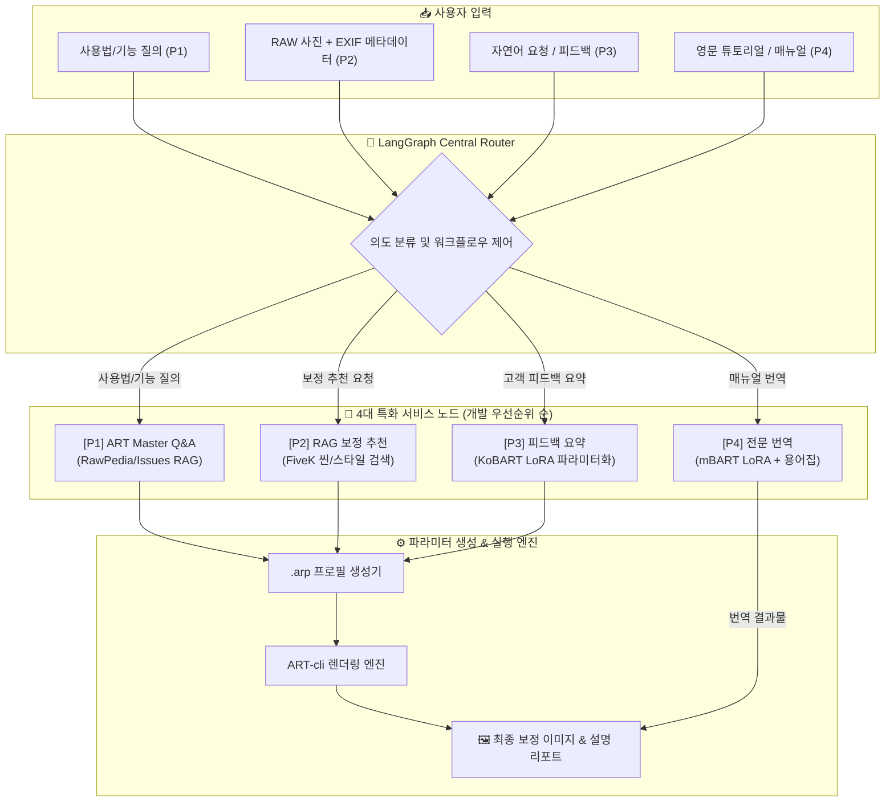

# ART 기반 Agentic AI 프로젝트 기획 발표 요약

---

## 1. 프로젝트 설명 (Project Overview & Domain)

이 프로젝트는 자연어 처리, 임베딩, RAG, 파인튜닝, 에이전트 등 핵심 AI 기술을 실제 서비스 문제에 적용해보는 실전 프로젝트입니다. 실제 사용자 요구와 데이터를 바탕으로 AI 서비스를 직접 설계·구현하며, 모델을 **데이터와 사용자 맥락에 맞게 활용하고 조정하는 실전 응용 역량**을 기르는 데 목적이 있습니다.

### 🌟 프로젝트 주제 매핑 (개발 우선순위 기반 통합)
본 프로젝트는 제시된 4가지 핵심 주제(Q&A/추천/요약/번역)를 분절된 단일 과제로 다루지 않고, 오픈소스 RAW 편집기 생태계 안에서 **실제 개발 우선순위(P1~P4)**에 맞춰 **하나의 완결된 LangGraph 멀티 에이전트 파이프라인으로 유기적 통합**합니다.

| 개발 우선순위 | 교육 과정 프로젝트 주제 | ART 도메인 실전 적용 과업 | 핵심 수행 내용 |
| :---: | :--- | :--- | :--- |
| **P1 (1순위/플래그십)** | **④ 문서 기반 Q&A / Agentic RAG** | **ART Master Q&A & 자동 보정 플래그십 챗봇** | RawPedia/Issues RAG, HyDE/리랭킹, `.arp` 생성 후 `ART-cli` 즉시 실행 |
| **P2 (2순위/핵심비전)** | **① 추천 서비스 (RAG 기반)** | **EXIF + 자연어 기반 RAW 보정 추천** | MIT-Adobe FiveK 씬/스타일 검색, `.arp` 파라미터 생성, 정량 평가(SSIM/LPIPS) |
| **P3 (3순위/부가가치)** | **② 텍스트 요약 서비스 (Agent)** | **모호한 리터칭 피드백 ➔ 파라미터 체크리스트 요약** | 피드백 데이터 지식 증류(Distillation), KoBART LoRA 파인튜닝, ROUGE 평가 |
| **P4 (4순위/확장기능)** | **③ 생성형 번역 서비스 (Agent / RAG)** | **리터처 톤 맞춤형 전문 문서/튜토리얼 번역** | AI Hub warm-start + RawPedia 도메인 튜닝, mBART LoRA, 용어집 제약 디코딩 |

### 🔍 왜 ART인가? (도메인 선정 및 차별화 포인트)
- **오픈소스 포크 기반 생태계**: 전문 RAW 현상 프로그램인 **ART**(RawTherapee에서 파생된 오픈소스 툴)를 도메인으로 선정하여 실제 프로덕션 수준의 도메인 문제를 다룹니다.
- **`.arp` 텍스트 프로필 구조**: ART의 파라미터 프로필(`.arp`)은 INI 스타일의 텍스트 포맷으로, LLM의 구조화된 생성(Structured Output) 및 파싱에 최적화되어 있습니다.
- **실제 이미지 자동 현상 (Closed-Loop 데모)**: 텍스트 답변만 제시하는 일반 챗봇과 달리, `ART-cli`를 직접 구동하여 **사용자의 자연어 요청으로부터 최종 보정 이미지까지 산출하는 완결형 피드백 루프**를 제공합니다.
- **외부 에이전트 레이어 포지셔닝**: ART 코어 자체를 수정하는 대신, 툴을 감싸는 외부 지능형 에이전트 레이어로 설계하여 안정성과 확장성을 극대화합니다.

---

## 2. 전체 시스템 아키텍처 (System Architecture)

사용자 입력(자연어 요청, RAW 이미지, EXIF 메타데이터)을 분석하여 최적의 서브 에이전트로 라우팅하고, 최종적으로 `.arp` 파라미터를 생성해 `ART-cli`로 렌더링하는 엔드투엔드 파이프라인입니다.

---

## 3. 4대 핵심 서비스 상세 (개발 우선순위 순)

### [P1] 문서 기반 Q&A / Agentic RAG 챗봇 (ART Master Agent - 1순위 플래그십)
- **우선순위 선정 이유**: RawPedia 매뉴얼, RELEASE_NOTES, GitHub Issues(81+) 등 실존 데이터 기반으로 **데이터 구축 리스크가 가장 낮고, 프로젝트 초기 가장 빠르게 완결된 데모를 확보**할 수 있는 코어 과업.
- **입력**: ART 사용법, 기능 문의, 버그 대처법 질문
- **출력**: 기능 설명 답변 + 즉시 적용 가능한 `.arp` 자동 생성 및 실시간 렌더링
- **핵심 기술**:
  - RawPedia/이슈 기반 고밀도 벡터 코퍼스 구축
  - 질문 재작성(Query Rewriting), HyDE, Cross-Encoder 리랭킹
  - **플래그십 데모 완결성**: 질의응답에서 바로 `.arp`를 생성하고 `ART-cli`로 즉시 시연
- **정량 평가**: **RAGAS 프레임워크** (Context Precision/Recall, Faithfulness)

### [P2] RAG 기반 보정 추천 서비스 (2순위 핵심 비전)
- **우선순위 선정 이유**: 사용자의 RAW 사진 메타데이터와 스타일 요구를 해석해 실제 보정 파라미터를 생성하는 **Closed-Loop의 핵심 가치**를 구현하는 과업.
- **입력**: RAW 사진의 EXIF(ISO, 셔터스피드, 카메라 모델 등) + 자연어 스타일 요청(예: "따뜻한 골든아워 느낌")
- **출력**: 최적화된 `.arp` 파라미터 + 근거 설명 리포트
- **핵심 기술**:
  - MIT-Adobe FiveK(RAW 5,000장 + 전문가 슬라이더값 + 씬 라벨) 데이터셋 활용
  - 씬/스타일 임베딩 유사도 기반 유사 사례 검색(Top-k) ➔ 파라미터 매핑 생성
- **정량 평가**: `ART-cli` 렌더링 결과물과 FiveK 기준 정답 간의 **SSIM / LPIPS / ΔE(색차)** 평가

### [P3] Agent 기반 피드백 요약 서비스 (3순위 부가 가치)
- **우선순위 선정 이유**: 모호한 사람의 언어를 정확한 소프트웨어 파라미터로 변환하는 실전 비즈니스 가치 제공.
- **입력**: 모호한 고객/클라이언트의 리터칭 피드백 (예: "매트하고 감성적인 무드로 톤 다운해줘")
- **출력**: 단계별 ART 현상 파라미터 체크리스트
- **핵심 기술**:
  - **지식 증류(Distillation)**: 대형 LLM으로 의사 라벨(Pseudo-label) 대량 생성 후 수작업 검수 골드셋 분리
  - **KoBART + LoRA 파인튜닝**: 도메인 특화 경량 요약 모델 구축
- **정량 평가**: 골드셋 대비 **ROUGE 스코어** 및 **ART 실제 파라미터명 매칭 정확도** 측정

### [P4] 생성형 전문 번역 서비스 (4순위 확장 기능)
- **우선순위 선정 이유**: 영문 가이드 및 튜토리얼 접근성을 높이는 확장형 기능으로, 타 과업과 독립적으로 개발 가능.
- **입력**: ART 영문 공식 가이드 및 해외 튜토리얼
- **출력**: 국내 전문 리터처 톤앤매너의 한글 번역문 + 공식 UI 영문 용어 원문 병기
- **핵심 기술**:
  - AI Hub 병렬 코퍼스로 Warm-start ➔ RawPedia 데이터 기반 2차 도메인 파인튜닝 (mBART/NLLB + LoRA)
  - **용어집 제약 디코딩 & 후처리**: UI 용어 원문 병기율 100% 보장 (톤은 모델이 학습, 용어는 규칙으로 통제)
- **정량 평가**: 골드 번역셋 대비 **BLEU 스코어** 및 **용어집 커버리지율** 측정

---

## 4. 핵심 엔지니어링 깊이 & 다차원 정량 평가 체계

### 🔬 엔지니어링 깊이 (Technical Rigor)
1. **RAG 코퍼스와 벤치마크 평가 데이터 분리 (FiveK 데이터셋)**
   - 학계 표준인 **Expert C**는 정량적 회귀 벤치마크 평가용으로 고정
   - **전문가 5인(A~E) 전체 데이터**는 RAG 검색 코퍼스로 구축하여 스타일 프롬프트별 다양한 추천 선택지 확보
2. **소규모 도메인 데이터 한계 극복 전략**
   - **피드백 요약(P3)**: 대형 LLM의 의사 라벨링을 활용한 **지식 증류(Knowledge Distillation)** 및 독립 평가용 골드셋 구축
   - **전문 번역(P4)**: 대규모 일반 병렬 데이터로 **Warm-start** 후 소규모 정제 데이터로 2차 전이학습
3. **효율적인 경량 파인튜닝 (PEFT/LoRA)**
   - 대규모 GPU 자원 낭비 없이 빠른 실험 반복을 위해 KoBART, mBART 모델에 **LoRA** 적용

### 📊 다차원 정량 평가 체계 요약 (우선순위 기준)
| 개발 우선순위 | 평가 영역 | 적용 서비스 | 사용 평가지표 | 평가 목적 |
| :---: | :--- | :--- | :--- | :--- |
| **P1** | **RAG 검색 & 생성 품질** | ④ Master Q&A (1순위) | **RAGAS** (Faithfulness, Context Precision/Recall) | 검색 정확도 및 환각(Hallucination) 방지 검증 |
| **P2** | **최종 이미지 렌더링 품질** | ① 보정 추천 (2순위) | **SSIM, LPIPS, ΔE(색차)** | `ART-cli`로 실제 렌더링된 사진의 품질 및 기준본 일치도 검증 |
| **P3** | **요약 & 정보 추출 정확도** | ② 피드백 요약 (3순위) | **ROUGE-1/2/L**, 파라미터명 일치율 | 핵심 요구사항 요약 및 UI 파라미터 매핑 검증 |
| **P4** | **도메인 번역 품질** | ③ 전문 번역 (4순위) | **BLEU**, 용어집 커버리지율 | 리터칭 도메인 톤 일관성 및 UI 원문 병기율 검증 |
