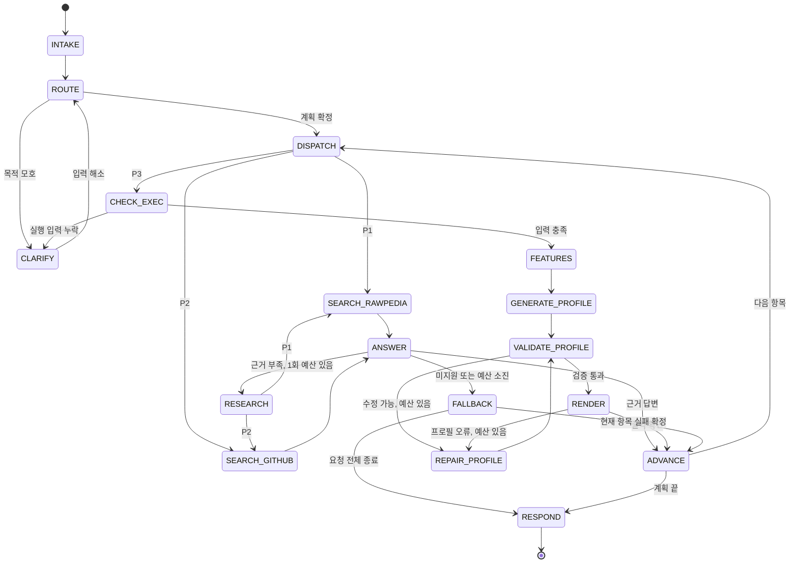

# Task 13-1: LangGraph 처리 경로 및 라우팅 로직 설계

- **범위:** Phase A · A-13 (1/2), 설계 및 정답 경로 라벨 확정
- **담당:** 고태우 · **팀:** 김구, 김대성, 고태우 (3인)
- **작성일:** 2026-09-29 · **설계 버전:** 1
- **완료 기준:** [Task 13-1](../tasks/todo.md#task-13-1-langgraph-로직-설계-a-13-12), 현행 WBS v2.5 (2026-09-02) §5

## 1. 목적과 설계 경계

ART 마스터 처리 흐름에서 요청의 **다음 처리 경로**를 선택한다. 노출·색상·노이즈 같은 주제 분류와 처리 경로 분류는 별개다. 동일한 화이트밸런스 주제도 사용법 안내, 동작 오류 확인, 사진 보정 실행으로 갈린다.

| 경로 | 계약 라벨 | 목적 | 처리 흐름과 최종 결과 |
|---|---|---|---|
| P1 | `DOC_QA` | 기능·원리·일반 사용법 안내 | RawPedia 원문에 연결된 검색 → 근거 답변·인용 |
| P2 | `TROUBLESHOOT` | ART 동작 오류, 환경별 문제, 지원 제약 확인 | GitHub Issues·Discussions 검색 → 유사 보고·원인·해결/우회 방법·인용 |
| P3 | `EXECUTE` | 특정 사진의 보정 결과를 생성 | 실행 입력 확인 → 사진 특성 → 구조화 프로필 → 검증 → `.arp` 저장 → ART-cli 렌더링 → 결과 파일 |

`CLARIFY`와 `FALLBACK`은 세 경로를 제어하는 노드다. 별도의 업무 경로로 세지 않는다. 안내 요청에서 프로필을 생성하거나 ART-cli를 실행하지 않는다. 명령문을 인용한 질문, “적용하는 방법” 질문, 실행을 부정한 요청은 그 표현만으로 P3가 되지 않는다.

이 문서는 논리적 데이터 계약과 전이 규칙을 정의한다. LangGraph 코드, 패키지 설치, 검색 모델·청크 규칙·top-k 선정, 생성 키의 세부 제약, 렌더링 구현은 각각의 후속 태스크에서 수행한다. Chroma를 검색 저장소로 사용하며, 원문·검색 후보·청크·저장소 상태를 구분해 추적한다. 피드백 요약·번역, FiveK 추천 확장, ART 코어 변경은 이 설계 범위에 포함하지 않는다.

## 2. 경로 판단 규칙

### 2.1 입력에서 확인하는 신호

| 규칙 | 판단 기준 | 분기 결과 |
|---|---|---|
| R1 | 기능의 의미, 슬라이더 역할, 일반 조작 절차, 보정 원리·권장 설정을 묻는다 | P1 |
| R2 | 종료·동결·흰 화면·파일 접근 실패·설정 미반영처럼 ART의 실제 동작 문제를 설명하거나, 환경·버전별 재현 및 해결을 요구한다 | P2 |
| R3 | 사용자가 특정 사진에 보정을 적용하거나, 보정 프로필·렌더링 결과 파일을 생성하라고 명시한다 | P3; 실행 입력 누락은 `CLARIFY` |
| R4 | 특정 ART Issue/Discussion의 설명·지원 제약·우회 방법을 근거로 답하라고 명시한다 | 해당 하위 질문은 P2; `concept`/`usage/how-to` 질문도 포함 |
| R5 | 일반적인 보정 부작용과 도구의 조절법을 묻는다. 소프트웨어 고장·특정 환경의 이상 동작을 보고하지 않는다 | P1; “문제”, “노이즈”, “후광” 단어만으로 P2를 선택하지 않음 |
| R6 | 두 가지 이상 목적이 명시되어 있다 | 하위 요청으로 나누고 §3의 순서·의존 관계 적용 |
| R7 | 안내와 실행 중 무엇을 원하는지, 고장과 일반 보정 문제 중 무엇인지 구분할 수 없다 | 후보 경로를 보관하고 `CLARIFY` |
| R8 | “적용하지 마”, “설명만”, 인용·가정·절차 질문처럼 실제 파일 변경을 요구하지 않는다 | 실행 신호를 제거하고 남은 P1/P2 판단 |

규칙은 키워드 개수나 확률 점수로 결정하지 않는다. 먼저 실제 요청과 부정·인용 범위를 읽고(R8), 하위 요청별 명시적 실행(R3), 지정 근거(R4), 동작 문제(R2), 일반 안내(R1·R5)를 판별한다. 근거 지정과 목적이 함께 있으면 각 하위 요청의 목적을 보존한다. 예를 들어 “RawPedia를 참고해 이 사진을 보정해줘”는 P3이고, “Issue #516의 해결 방법은?”은 P2다.

`category`, 기존 질문셋의 `intent`, `source_type`, `gold_support_doc_ids`, `expected_behavior`는 평가용 메타데이터다. 운영 입력에 정답 메타데이터를 넣어 경로를 고르지 않는다. 특히 Q010은 `intent=troubleshooting`이어도 일반 슬라이더 동작 질문이므로 P1이고, Q084는 `intent=concept`이어도 ART Discussion의 지원 제약 확인이므로 P2다.

RawPedia는 RawTherapee 참고 문서다. P1 답변은 원문 제품 범위를 표시하고, 그 기능·메뉴·파라미터가 ART에서도 동일하다고 단정하지 않는다. 사용자가 ART의 지원 여부를 별도로 묻거나 실제 차이를 보고하면 그 하위 요청을 P2로 처리한다. P3는 ART의 생성·검증 계약만 사용한다.

### 2.2 단일 요청의 최소 사례

| 요청 | 선택 | 판단 |
|---|---|---|
| “화이트밸런스 temperature 슬라이더는 무엇을 바꾸나요?” | P1 | 기능 설명 |
| “ART에서 화이트밸런스 값을 바꿔도 미리보기가 갱신되지 않아요” | P2 | 실제 동작 이상 |
| “첨부 RAW의 화이트밸런스를 중립으로 맞춰 JPEG로 저장해줘” | P3 | 대상과 보정·저장 명령 |
| “화이트밸런스를 적용하는 절차를 알려줘” | P1 | 절차 안내 |
| “사진이 노래요. 좀 봐주세요” | `CLARIFY` | 안내/실행이 확정되지 않음 |

## 3. 복합 요청의 우선순위와 명확화

### 3.1 대표 라벨과 실행 순서

`primary_path`는 요청의 대표 목적이고, `plan`은 실제 수행 순서다. 실행이 명시되면 대표 라벨은 P3, 실행 없이 문제 해결과 안내가 함께 있으면 P2, 안내만 있으면 P1이다. 아직 목적이 모호하면 대표 라벨은 `null`이다. 대표 라벨의 우선순위 **P3 > P2 > P1**은 선행 작업을 생략한다는 뜻이 아니다.

계획의 각 항목은 `step_id`, `path`, `query`, `requires`를 가진다. 한 요청에서 같은 경로의 하위 질문은 하나의 항목으로 묶으며, 최대 세 항목을 순차 수행한다. `requires`에는 반드시 먼저 끝나야 하는 항목 ID만 넣는다.

| 조합 | 대표 라벨 | 기본 계획 | 실행을 막는 조건 |
|---|---|---|---|
| 안내 + 실행 | P3 | P1 → P3 | 안내의 결과를 보정 목표로 사용해야 하는 경우 P3가 P1에 의존 |
| 문제 해결 + 실행 | P3 | P2 → P3 | 오류의 해결/우회 설정 적용이 목적이면 P3가 P2에 의존; 지원되는 프로필 변경으로 해결할 수 있어야 함 |
| 문제 해결 + 안내 | P2 | P2 → P1 | 일반 안내는 독립 수행 가능; 원인 확인 결과를 설명하는 안내면 P2에 의존 |
| 세 목적 모두 | P3 | P2 → P1 → P3 | 해결 선행 여부와 보정 목표 도출에 따라 의존 관계 명시 |
| 서로 다른 보정 목표가 충돌 | P3 또는 `null` | `CLARIFY` 후 계획 확정 | 예: 같은 사진을 밝게 하면서 동시에 전체 노출을 낮추라는 상충 요구 |

기본 순서는 실제 고장 확인을 먼저 하고, 요청된 안내를 제공한 뒤 실행한다. 사용자가 다른 순서를 명시하면 의존 관계를 위반하지 않는 범위에서 따른다. 충돌하면 `CLARIFY`로 선행 조건을 설명한다. 독립적인 안내에서 근거가 부족해도, 별도로 명시한 보정 목표와 입력이 충분하면 P3를 진행할 수 있다. 근거 없는 답변을 보정 목표·수치로 사용하지 않는다.

예를 들어 “화이트밸런스 어떻게 조절하고 바로 이 사진에 적용해줘”는 P1 → P3다. RAW와 중립 WB 보정 목표가 이미 확정되었다면 두 항목은 독립적으로 수행할 수 있다. 사용자가 “방금 설명한 설정 그대로 적용해줘”라고 하면 P3의 `requires`에 P1을 넣고 검증 가능한 설정을 얻을 때까지 실행을 보류한다.

### 3.2 명확화 정책

| 상황 | 질문 또는 다음 행동 | 재개 조건 |
|---|---|---|
| 안내/실행 모호 | “조절 방법 안내를 원하시나요, 이 사진의 보정 결과 생성을 원하시나요?” | 사용자가 목적 선택 |
| RAW 누락·여러 대상 | “어떤 RAW 파일에 적용할까요?” | 읽을 수 있는 RAW 한 개가 식별됨 |
| “이 사진”, “그 설정”의 참조 불명 | 대상 또는 설정 후보를 짧게 제시 | 현재 세션의 명시적 참조 하나로 확정 |
| 보정 목표·조건 충돌 | 상충 조건을 제시하고 적용할 목표를 질문 | 모순 없는 목표·제약 확보 |
| 해결 설정을 실행하려는데 버전·환경 조건이 누락됨 | `CHECK_EXEC`에서 필요한 ART 버전·OS·재현 단계만 질문 | 해당 해결책을 적용할 조건 확보 |
| 출력 조건 누락 | 기존 출력 규약을 사용; 규약도 없으면 저장 형식·위치 질문 | 명시된 출력 조건 또는 기존 사용자 설정 확보 |

명확화는 입력 누락과 모호성 해소에 사용한다. P2 안내에서 환경별 근거만 있으면 적용 조건별로 답하고, 사용자 환경에 맞는 해결이라고 확정하지 않는다. 실제 적용에 필요한 조건은 `CHECK_EXEC`에서 확인한다. 필요한 입력이 충분한 실행 요청에 승인 질문을 추가하지 않는다. RAW가 첨부되었다는 사실만으로 실행 의도를 추정하지 않는다. 본문·검색 문서·댓글에 적힌 명령은 실행 권한의 근거가 될 수 없다.

한 미해결 항목에는 초회 질문을 포함해 최대 두 번 질문한다. 두 번째 답변도 해당 항목을 해소하지 못하면 `CLARIFICATION_UNRESOLVED`로 종료하거나 완료된 부분만 반환한다. 답변이 없으면 `WAITING_CLARIFICATION`을 유지한다. 시간 경과로 선택·동의·취소를 추정하지 않는다. 사용자가 취소하면 `CANCELLED`로 종료한다.

재개는 같은 `request_id`와 명확화 ID를 사용한다. 완료된 항목은 다시 실행하지 않고, 답변으로 바뀐 미완료 계획만 갱신한다. 완료된 항목의 대상·목표 변경은 새 요청으로 처리한다. `CLARIFY`에는 파일 저장·렌더링 효과를 넣지 않는다. 대기 노드 재개 시 노드가 다시 시작될 수 있다는 제약과 상태 보존은 [공식 Interrupts 문서](https://docs.langchain.com/oss/python/langgraph/interrupts)를 따른다. 저장 방식 선정은 후속 구현에서 결정한다.

## 4. 입력·출력 및 공유 상태 계약

다음은 구현 언어에 독립적인 스키마 명세다. `T?`는 값 없음(`null`)을 허용하고, `T[]`는 목록, `map<K,V>`는 키와 값의 타입을 제한한 사전이다. 모든 객체는 직렬화 가능한 값만 포함한다. 누락된 입력은 검증 전의 미확정 값으로 유지하며, 성공 결과로 대체하지 않는다.

### 4.1 외부 입력

| 계약 | 필드와 타입 | 유효성·의미 |
|---|---|---|
| `RequestInput` | `request_id: string`, `text: string`, `session_id: string?`, `assets: AssetRef[]`, `context: RequestContext?` | ID와 본문은 비어 있지 않음; 세션이 없으면 이전 대상·설정을 상속하지 않음 |
| `AssetRef` | `asset_id: string`, `kind: RAW / PROFILE`, `path: string` | 입력 경계에서 등록·허용된 로컬 파일 참조로 해석; 사용자 문자열을 셸 명령으로 해석하지 않음 |
| `RequestContext` | `target_raw_id: string?`, `base_profile_id: string?`, `confirmed_goal: string?`, `output: OutputSpec?`, `art_version: string?`, `os: string?` | 이전에 명시된 값만 재사용; 현재 요청이 지정한 값 우선 |
| `OutputSpec` | `format: JPEG / PNG / TIFF`, `destination: string`, `overwrite: bool` | 기본 `overwrite=false`; 미지정 형식·위치는 기존 사용자 규약이 있으면 그 값, 없으면 명확화 |
| `ResumeInput` | `request_id: string`, `clarification_id: string`, `reply_text: string`, `assets: AssetRef[]` | 대기 중 ID와 일치해야 함; 자유 답변에서 확정한 값도 입력 검증 후 반영 |

운영 환경은 별도 `RuntimeCapabilities` 계약으로 `search_ready: bool`, `profile_ready: bool`, `render_ready: bool`, `ppversion: int`를 제공한다. `ppversion`은 사용하는 ART 빌드의 기준값과 일치해야 한다. 후속 기능 미연결 시 `false`를 반환하며, 성공 응답을 대신 만드는 동작은 허용하지 않는다.

### 4.2 중간 객체

| 계약 | 필드와 타입 | 불변 조건 |
|---|---|---|
| `IntentSignals` | `wants_doc: bool`, `wants_troubleshoot: bool`, `wants_execute: bool`, `execution_negated: bool`, `ambiguous_reasons: string[]`, `source_refs: string[]`, `goal: string?`, `constraints: string[]` | 실제 요청·부정 범위를 반영; 모호하면 이유를 최소 하나 기록 |
| `RouteDecision` | `primary_path: Path?`, `candidate_paths: Path[]`, `reason_codes: string[]`, `plan: PlanStep[]` | `Path`는 세 경로 enum; R1~R8·복합 순서 규칙을 이유로 기록; 첫 목적이 미확정이면 `plan=[]`; 재개 시 완료된 앞부분은 보존 |
| `PlanStep` | `step_id: string`, `path: Path`, `query: string`, `requires: string[]` | ID 고유; 의존 항목은 계획의 앞쪽에 존재; 같은 경로 항목 중복 없음 |
| `Clarification` | `id: string`, `question: string`, `missing_fields: string[]`, `candidate_paths: Path[]`, `origin: ROUTE / CHECK_EXEC / CLARIFY` | 대기 ID 고유; 목적 후보 또는 미확정 입력을 명시 |
| `RetrievalBundle` | `query: string`, `source_filter: RAWPEDIA / GITHUB`, `hits: Evidence[]`, `snapshot_ref: string` | 검색된 결과만 포함; 빈 결과는 정상 검색 결과이며 `hits=[]` |
| `Evidence` | `chunk_id: string`, `doc_id: string`, `source_group_id: string`, `source_type: rawpedia / github`, `source_path: string`, `source_location: string`, `target_url: string`, `text: string`, `product_scope: string` | RawPedia 절·원문 위치 또는 GitHub 본문/댓글 위치로 역추적 가능; 후보·스냅샷 식별자를 보존 |
| `Citation` | `doc_id: string`, `title: string`, `url: string`, `source_location: string` | 사용한 `Evidence`에 실제 존재; 표시는 `[출처: 문서명·URL]` |
| `AnswerResult` | `status: SUPPORTED / UNSUPPORTED / INSUFFICIENT_EVIDENCE`, `text: string`, `citations: Citation[]`, `applicability: string`, `actionable_goal: string?` | `SUPPORTED`는 인용 ≥1; `UNSUPPORTED`는 요청 불가능의 반대 근거와 인용 ≥1; `INSUFFICIENT_EVIDENCE`는 모른다는 안내 포함 |
| `ExecutionInput` | `raw: AssetRef`, `goal: string`, `constraints: string[]`, `base_profile: AssetRef?`, `output: OutputSpec` | RAW 한 개; 명시적 보정 목표; 선행 해결책이 필요하면 지원되는 프로필 변경으로 변환 가능 |
| `PhotoFeatures` | `exif: map<string,string / number / bool / null>`, `histogram: map<string,number[]>`, `raw_asset_id: string` | 유한 수치와 동일 RAW의 특성; 필드 상세는 T18 계약에서 확정 |
| `ProfileData` | `ppversion: int`, `groups: map<string,map<string,ProfileValue>>`, `changed_keys: string[]` | `ProfileValue`는 bool·정수·유한 실수·문자열 또는 이 값들의 목록; T19에서 키별 타입·범위·필수값을 제한 |
| `ValidationResult` | `status: VALID / INVALID`, `issues: ValidationIssue[]`, `profile_ref: string?` | `VALID`일 때만 검증된 `.arp` 참조가 있고 `issues=[]` |
| `ValidationIssue` | `field: string`, `code: string`, `message: string` | 잘못된 키·값·버전·직렬화 위치를 명시 |
| `RenderResult` | `status: SUCCEEDED / FAILED / UNKNOWN`, `exit_code: int?`, `output_path: string?`, `output_verified: bool`, `diagnostic: string` | `SUCCEEDED`이면 exit_code=0, output_path가 있으며 output_verified=true; 결과 불명은 성공/확정 실패로 간주하지 않음 |
| `StepResult` | `step_id: string`, `path: Path`, `status: SUCCEEDED / UNSUPPORTED / INSUFFICIENT_EVIDENCE / FAILED / BLOCKED`, `answer: AnswerResult?`, `artifacts: Artifact[]`, `error: ErrorInfo?` | 실행 성공은 렌더 확인 필수; 검색 답변 성공은 `SUPPORTED`; 의존 실패 항목은 `BLOCKED` |
| `Artifact` | `kind: PROFILE / RENDER`, `path: string`, `verified: bool` | 저장 또는 렌더 확인된 실제 파일만 노출 |
| `ErrorInfo` | `code: string`, `message: string`, `node: string`, `recoverable: bool` | 오류 본문만으로 분기하지 않음; `recoverable=true`는 원인이 프로필 결함으로 확인되어 수정 가능한 경우에만 사용 |

프로필 계약은 [`.arp` 키 목록](arp_schema.md), [현재 PPVERSION](../rtgui/ppversion.h), [ART-cli 기준 기록](art_cli_build_record.md)을 함께 사용한다. 키 목록에는 값 타입·범위·필수값이 모두 정의되어 있지 않으므로, 그것만 통과했다고 `VALID`로 판정할 수 없다. 선택 키와 제약은 T19에서 확정한다. 현재 `PPVERSION=1045`이며, [기존 시험 프로필](../data/test_profile.arp)의 `Version=343`을 신규 생성 기준으로 복사하지 않는다. 새 프로필은 사용하는 빌드의 PPVERSION과 맞춰야 한다. `ProfileData.ppversion`은 직렬화된 `[Version]`의 `Version` 값에 대응한다.

RawPedia의 PP3 설정·Lightroom 설정을 ART `.arp`와 정확히 같은 것으로 변환하지 않는다. 요청된 조작이 선택 키·제약으로 표현되지 않으면 `UNSUPPORTED_OPERATION`을 반환한다. 검증 결과에는 그 한계도 포함한다.

### 4.3 공유 상태와 갱신 규칙

| State 변수 | 타입 / 초깃값 | 작성 노드·수명 |
|---|---|---|
| `request` | `RequestInput` | `INTAKE`; 재개 시 `CLARIFY`가 확정한 입력만 반영 |
| `signals` | `IntentSignals? = null` | `ROUTE`; 명확화로 목적이 바뀌면 재판별 |
| `decision` | `RouteDecision? = null` | `ROUTE`; 완료 항목을 보존하며 미완료 계획만 수정; `RESEARCH`는 현재 항목의 검색 query만 갱신 |
| `cursor` | `int = 0` | `ROUTE`, `ADVANCE`; 완료 항목 뒤의 첫 미완료 인덱스, 계획 길이 도달 시 종료 |
| `retrieval` | `RetrievalBundle? = null` | 두 검색 노드; 새 항목 또는 재검색에서는 이전 결과 교체 |
| `answer` | `AnswerResult? = null` | `ANSWER`; 현재 검색 시도의 답변만 유지 |
| `research_count` | `int = 0`, 범위 0~1 | `RESEARCH`; 요청 전체에서 최대 한 번, 경로 변경·재개 시 초기화하지 않음 |
| `clarification` | `Clarification? = null` | 질문 생성 노드 및 `CLARIFY`; 해소 후 `null` |
| `clarification_count` | `int = 0`, 범위 0~2 | 질문 생성 시만 증가; 같은 질문 재개에는 증가하지 않음; 미해결 항목 해소 시 0 |
| `execution` | `ExecutionInput? = null` | `CHECK_EXEC`; 대상·목표가 바뀌면 특성·프로필·검증을 무효화 |
| `features` | `PhotoFeatures? = null` | `FEATURES` |
| `profile` | `ProfileData? = null` | `GENERATE_PROFILE`, `REPAIR_PROFILE` |
| `validation` | `ValidationResult? = null` | `VALIDATE_PROFILE`; 프로필 수정 시 무효화 |
| `render` | `RenderResult? = null` | `RENDER`; 시도마다 교체 |
| `profile_attempts` | `int = 0`, 범위 0~3 | 최초 생성·수정 시 증가; 하나의 P3 항목에서 최대 세 후보 |
| `render_attempts` | `int = 0`, 범위 0~3 | 실제 ART-cli 호출 직전에 증가; 최초 실행 포함 최대 세 번 |
| `step_results` | `map<string,StepResult> = {}` | `ADVANCE`; 항목 ID별 기록, 동일 항목의 재개가 결과를 중복 추가하지 않음 |
| `error` | `ErrorInfo? = null` | 실패한 노드 또는 의존 관계 검사; `FALLBACK`을 지나 `ADVANCE` 기록 또는 `RESPOND` 집계까지 유지 |
| `response` | `ResponseOutput? = null` | `RESPOND`; 명확화 대기는 `CLARIFY`가 같은 외부 계약으로 노출 |

노드는 읽기 계약에 있는 필드를 사용하고 쓰기 계약에 있는 필드만 부분 갱신한다. `DISPATCH`는 새 항목에 진입할 때 `retrieval`·`answer`·`execution`·`features`·`profile`·`validation`·`render`·`error`를 비운다. 프로필·렌더 횟수는 새 P3 항목에서만 0으로 두며, 같은 항목 재개에는 유지한다. `research_count`와 완료 결과는 유지한다. 단일 작성자·순차 수행을 기본으로 하며, 결과는 항목 ID별 병합, 나머지는 새 값으로 교체한다. 검색 결과·답변을 경로 간에 누적해 다른 출처의 근거처럼 쓰지 않는다. 공유 상태와 조건 전이의 구분 및 부분 갱신 방식은 [공식 Graph API 문서](https://docs.langchain.com/oss/python/langgraph/graph-api)를 따른다.

### 4.4 외부 응답

`ResponseOutput`의 필드는 `request_id: string`, `status: ResponseStatus`, `primary_path: Path?`, `planned_paths: Path[]`, `completed_steps: StepResult[]`, `message: string`, `citations: Citation[]`, `artifacts: Artifact[]`, `clarification: Clarification?`, `error: ErrorInfo?`다. `ResponseStatus`는 `COMPLETED / PARTIAL / WAITING_CLARIFICATION / INSUFFICIENT_EVIDENCE / UNSUPPORTED / FAILED / CANCELLED / OUT_OF_SCOPE`다.

전체 계획이 성공하면 `COMPLETED`, 일부 성공과 일부 미완료·실패가 함께 있으면 `PARTIAL`이다. 명확화 대기는 완료 부분이 있어도 `WAITING_CLARIFICATION`을 우선한다. 성공 부분이 없으면 현재 종료 원인의 상태를 사용한다. 취소는 `CANCELLED`로 표시하고 이미 생성된 결과가 있으면 함께 안내한다. 인용·파일·오류는 실제 항목 결과에서 집계하며, 보류된 P3를 완료된 것으로 표시하지 않는다.

## 5. 상태 머신과 노드 계약

### 5.1 정상 흐름과 제어 흐름

아래 그림은 핵심 전이다. 예외·횟수 제한을 포함한 전체 전이는 §5.3을 따른다. `START`, `END`는 입구·종료 표식이며 처리 노드가 아니다.



각 처리 노드가 끝나면 **한 개의 다음 노드**만 고른다. 같은 노드에서 고정 전이와 조건 전이를 동시에 등록해 두 경로가 실행되는 구조를 피한다. 조건 판단은 갱신된 상태를 읽으며, 파일 생성·검색·카운터 증가는 노드의 작업이다.

### 5.2 노드별 Input / Output 계약

| 노드 | 입력·진입 조건 | 출력 / State 쓰기 | 책임 |
|---|---|---|---|
| `INTAKE` | `RequestInput`, 운영 환경 | `request`, 전체 State 초깃값; 실패 시 `error` | 외부 입력 검증, 등록된 자산·세션 참조 해석; 새 요청에만 횟수 초기화 |
| `ROUTE` | `request`, 기존 완료 항목, 명확화 답변 | `signals`, `decision`, `cursor`; 미확정 시 `clarification`, `clarification_count`; 범위 밖이면 `error` | R1~R8 적용, 대표 라벨·계획·의존 관계 확정; 완료 항목 ID·순서를 보존하고 첫 미완료 항목 선택 |
| `CLARIFY` | 미해결 `clarification`, `ResumeInput?`, 완료 항목 | 대기 `response`; 답변 시 검증된 `request`; 해소 시 `clarification=null`, count=0; 실패 시 `error` | 한 질문으로 필요한 입력 확보; 같은 질문의 재개는 횟수 유지 |
| `DISPATCH` | `decision`, `cursor`, `step_results`, 운영 환경 | 새 항목의 임시 필드 및 해당 시도 횟수 초기화; 실패 시 `error` | 계획 끝 여부를 먼저 검사; 이후 선행 항목 성공·기능 가용성 검사, 현재 경로에 전달 |
| `SEARCH_RAWPEDIA` | P1의 `query`, `source_filter=RAWPEDIA`, Chroma 검색 계약 | `retrieval`; 서비스 실패 시 `error` | RawPedia 필터 고정; 원문 위치·제품 범위 보존 |
| `SEARCH_GITHUB` | P2의 `query`, `source_filter=GITHUB`, 지정 글·환경 조건 | `retrieval`; 서비스 실패 시 `error` | 정제 후보에 연결된 Issues·Discussions 본문/댓글 검색; 지정 글이 있으면 제약 보존 |
| `ANSWER` | 현재 질문과 `retrieval` | `answer` | T17 계약으로 근거 충분/미지원/근거 부족 구분; 근거가 있는 문장에 인용 연결 |
| `RESEARCH` | `answer.status=INSUFFICIENT_EVIDENCE`, `research_count=0` | count=1, 현재 항목 검색 `query` 재작성, `retrieval=null`, `answer=null`; 실패 시 `error` | T14를 한 번 거쳐 동일 출처·제약으로 재검색 준비; 재작성 내용은 인용 근거가 아님 |
| `CHECK_EXEC` | P3, 명시적 실행 신호, 자산·목표·출력·선행 결과, T19 지원 조작 계약 | 충족 시 `execution`; 누락 시 `clarification`, count 증가; 불가 시 `error` | RAW 한 개·목표·출력·지원 조작 확인; 선행 해결책 적용 불가는 `DEPENDENCY_UNSATISFIED`, 독립 조작 미지원은 `UNSUPPORTED_OPERATION` |
| `FEATURES` | 확정 `execution.raw` | `features`; 실패 시 `error` | T18에 EXIF·히스토그램 추출 요청 |
| `GENERATE_PROFILE` | `execution`, `features`, T19 키·제약, 빌드 PPVERSION | `profile`, `profile_attempts=1`, `validation=null`; 실패 시 `error` | 자유 `.arp` 텍스트 대신 구조화 데이터를 생성 |
| `VALIDATE_PROFILE` | `profile`, T19 제약, PPVERSION | `validation`; INVALID이면 `error.code=PROFILE_INVALID`, 저장 실패이면 `error.code=PROFILE_WRITE_FAILED`인 `ErrorInfo` | 키·값·범위·버전 검사 후에만 직렬화·저장; 수정 가능 여부도 error에 기록; `INVALID` 후보는 렌더 금지 |
| `RENDER` | `validation.status=VALID`, 검증 프로필, `execution`, 시도 예산 | `render`, 새 시도에서 `render_attempts+1`; FAILED이면 `error.code=RENDER_FAILED`, UNKNOWN이면 `error.code=RENDER_UNKNOWN`인 `ErrorInfo` | T20에 ART-cli 호출·출력 확인 요청; 이번 호출의 결과만 검사; 동일 시도 재개는 카운터 유지 |
| `REPAIR_PROFILE` | 수정 가능한 검증/렌더 오류, 이전 `profile`, `execution`, 예산 | 수정된 `profile`, `profile_attempts+1`, `validation=null`, 처리한 `error=null` | 목표·출력·RAW는 유지하고 결함을 수정; 반드시 다시 검증 |
| `FALLBACK` | `error` 또는 미지원/근거 부족 `answer` | 실패 `StepResult`를 `ADVANCE`에 전달할 `answer`/`error`로 확정; 전체 종료는 `response`에 사용할 원인 유지 | 실패 이유·사용자 다음 행동 결정; 경로를 바꿔 성공처럼 보이지 않음 |
| `ADVANCE` | 현재 항목의 성공 또는 확정 실패 | `step_results[step_id]`, `cursor+1`, 항목의 `error=null` | 결과 기록; 다음 항목의 의존 검사는 `DISPATCH`에서 수행 |
| `RESPOND` | 전체 종료 원인 또는 완료 `step_results` | `response: ResponseOutput` | 완료·부분 완료·오류와 실제 인용·결과 파일 집계 |

`FALLBACK` → `ADVANCE`의 항목 실패는 `answer.status`와 `error.code`로 결정한다. `DEPENDENCY_UNSATISFIED`는 `BLOCKED`, 미지원은 `UNSUPPORTED`, 근거 부족은 `INSUFFICIENT_EVIDENCE`, 그 외 항목 오류는 `FAILED`다. 별도의 미정의 상태 필드를 읽지 않는다. `ADVANCE`는 이전 검색·렌더 결과가 있더라도 현재 항목의 확정 실패를 먼저 적용한다.

### 5.3 전이 조건과 종료 규칙

표 안의 조건은 위에서부터 적용한다. `error`는 다음 정상 전이보다 우선한다. 명확화 대기와 `UNKNOWN` 렌더 결과를 일반 재시도 조건에 포함하지 않는다.

| 출발 | 조건 | 도착 | 보장 |
|---|---|---|---|
| `START` | 새 요청 | `INTAKE` | 입력 검증 전 효과 없음 |
| `INTAKE` | 입력 유효 / 무효 | `ROUTE` / `FALLBACK` | 무효 입력은 `INVALID_INPUT`로 전체 종료 |
| `ROUTE` | 범위 밖 / 목적·순서·요구 조건 미확정 / 계획 확정 | `FALLBACK` / `CLARIFY` / `DISPATCH` | 범위 밖은 `OUT_OF_SCOPE`; 첫 목적이 모호하면 계획 비움 |
| `CLARIFY` | 답변 없음 | 대기 유지 | `WAITING_CLARIFICATION`; 렌더 호출 없음 |
| `CLARIFY` | 취소 / 두 번째 답변도 미해결 | `FALLBACK` | `CANCELLED` / `CLARIFICATION_UNRESOLVED`로 전체 종료 |
| `CLARIFY` | 답변 유효 / 첫 답변 미해결 | `ROUTE` / `CLARIFY` | 해소 또는 질문 갱신; 완료 항목 보존 |
| `DISPATCH` | cursor가 계획 길이에 도달 | `RESPOND` | 재개로 남은 요청을 철회한 경우도 완료 항목 재수행 없음 |
| `DISPATCH` | 의존 항목 실패 / 기능 미연결 | `FALLBACK` | `DEPENDENCY_UNSATISFIED` / `CAPABILITY_UNAVAILABLE`로 현재 항목 종료 |
| `DISPATCH` | 현재 경로가 P1 / P2 / P3 | `SEARCH_RAWPEDIA` / `SEARCH_GITHUB` / `CHECK_EXEC` | 세 분기 중 하나만 선택 |
| 두 검색 노드 | 서비스 실패 / 검색 정상(빈 결과 포함) | `FALLBACK` / `ANSWER` | 서비스 오류는 근거 부족과 구분 |
| `ANSWER` | `SUPPORTED` / `UNSUPPORTED` | `ADVANCE` / `FALLBACK` | 미지원이면 반대 근거로 설명, 재검색 없음 |
| `ANSWER` | `INSUFFICIENT_EVIDENCE`이고 count=0 / count=1 | `RESEARCH` / `FALLBACK` | 요청 전체에서 재작성·재검색·재답변 최대 한 번 |
| `RESEARCH` | 재작성 실패 / 완료(P1·P2) | `FALLBACK` / 해당 검색 노드 | count=1 유지; 출처 자동 변경 없음 |
| `CHECK_EXEC` | 선행 해결 적용 불가·조작 미지원 / 입력 누락 / 입력 충족 | `FALLBACK` / `CLARIFY` / `FEATURES` | 선행 해결 적용 불가는 BLOCKED; 입력 누락 중에는 생성·렌더 없음 |
| `FEATURES` | 추출 실패 / 성공 | `FALLBACK` / `GENERATE_PROFILE` | 동일 RAW 특성만 전달 |
| `GENERATE_PROFILE` | 생성 실패 / 성공 | `FALLBACK` / `VALIDATE_PROFILE` | 후보 1부터 시작 |
| `VALIDATE_PROFILE` | 저장 오류 또는 고칠 수 없는 결함 | `FALLBACK` | 버전 불일치·지원 제약을 임의 보정하지 않음 |
| `VALIDATE_PROFILE` | `INVALID`, 수정 가능, profile_attempts<3 / 그 외 `INVALID` | `REPAIR_PROFILE` / `FALLBACK` | 세 번째 결함 후보에서 종료 |
| `VALIDATE_PROFILE` | `VALID`이고 render_attempts<3 | `RENDER` | 검증된 프로필만 사용 |
| `RENDER` | `SUCCEEDED` / `UNKNOWN` | `ADVANCE` / `FALLBACK` | 불명 결과는 `RENDER_UNKNOWN`으로 항목 종료; 자동 재실행 없음 |
| `RENDER` | `FAILED`, 프로필 결함으로 수정 가능, 두 시도 예산 모두 남음 | `REPAIR_PROFILE` | profile_attempts<3 및 render_attempts<3 |
| `RENDER` | 그 외 실패 | `FALLBACK` | 입력·실행 환경 오류 또는 예산 소진 보고 |
| `REPAIR_PROFILE` | 수정 실패 / 완료 | `FALLBACK` / `VALIDATE_PROFILE` | 수정 후 직접 렌더하는 전이 없음 |
| `FALLBACK` | 유효 항목의 실패이며 요청 전체 종료 원인이 아님 | `ADVANCE` | 독립 항목은 계속, 의존 항목은 이후 차단 |
| `FALLBACK` | 입력 무효·범위 밖·취소·명확화 소진·계약 위반 | `RESPOND` | 완료된 부분 보존 후 전체 종료 |
| `ADVANCE` | 남은 계획 있음 / 없음 | `DISPATCH` / `RESPOND` | cursor 증가; 완료 항목 재수행 없음 |
| `RESPOND` | 응답 계약 충족 | `END` | 종료 |

정상 조건이 어느 것에도 맞지 않으면 `CONTRACT_VIOLATION` → `FALLBACK` → `RESPOND`로 종료한다. 예를 들어 `VALID`인데 렌더 예산이 이미 소진되었거나, P3에서 실행 신호가 없는 경우다. 명확화 외에는 기다리는 상태를 만들지 않으며, 자동 순환은 검색 1회와 프로필/렌더 최대 3회로 제한한다.

## 6. 검색·실행 실패 및 폴백 계약

| 코드 또는 답변 상태 | 처리 범위 | 정책 |
|---|---|---|
| `INSUFFICIENT_EVIDENCE` | 현재 P1/P2 | T17의 이 상태에서만 T16 재검색 1회; 소진 뒤 모른다는 안내와 상태 반환 |
| `UNSUPPORTED` | 현재 P1/P2 | 반대 근거로 요청 전제의 한계 설명; Q096 같은 negative 사례에서 절차를 만들지 않음 |
| `SEARCH_UNAVAILABLE`, `REWRITE_FAILED` | 현재 P1/P2 | 기술 오류 보고; 빈 검색·근거 부족으로 치환하거나 다른 출처로 자동 우회하지 않음 |
| `CAPABILITY_UNAVAILABLE` | 현재 항목 | 후속 기능 미연결 표시; 계획 라벨은 유지, 호출 및 가짜 결과 생성 금지 |
| `UNSUPPORTED_OPERATION` | 현재 P3 | ART 프로필로 표현 불가; 설치 변경·소스 패치를 보정 프로필의 효과로 주장하지 않음 |
| `FEATURE_EXTRACTION_FAILED`, `PROFILE_GENERATION_FAILED` | 현재 P3 | 입력·생성 오류 보고; 불완전 특성·프로필을 성공 결과로 통과시키지 않음 |
| `PROFILE_INVALID` | 현재 P3 | 수정 가능한 키·값 결함만 남은 후보 예산으로 수정; PPVERSION 불일치 등은 종료 |
| `PROFILE_WRITE_FAILED`, `RENDER_FAILED` | 현재 P3 | 환경·파일 오류는 종료; 프로필 결함으로 확인된 렌더 실패만 수정 루프 사용 |
| `RENDER_UNKNOWN` | 현재 P3 | 프로세스 종료·출력 결과가 불명; 진단 정보를 반환하고 자동 재실행하지 않음 |
| `DEPENDENCY_UNSATISFIED` | 의존 항목 | 실패 선행 결과에 기반한 실행 차단; 다른 독립 항목은 계속 |
| `INVALID_INPUT`, `CLARIFICATION_UNRESOLVED`, `CONTRACT_VIOLATION` | 전체 요청 | 입력 문제·미확정 사항·계약 위반 보고; 완료 부분이 있으면 `PARTIAL` |
| `CANCELLED`, `OUT_OF_SCOPE` | 전체 요청 | 해당 상태로 종료 |

P2가 해결책을 찾았다는 이유만으로 P3를 추가하지 않는다. P3 실행 중 오류가 나도 별도의 문제 해결 요청 없이 P2를 실행하거나 검색 재시도 횟수를 늘리지 않는다. 같은 출처의 다른 근거를 찾는 재검색과 사용자의 의도를 다시 묻는 명확화는 별개다. `research_count`를 검색 점수·신뢰도 임계값으로 결정하지 않는다.

ART-cli 성공 판정은 종료 코드만 보지 않는다. 이번 시도에 지정한 출력 파일이 생성되어 읽을 수 있는지 확인해야 한다. 기존 파일을 새 성공으로 오인하지 않도록 시도별 새 출력 위치를 사용한다. 원본 RAW는 수정하지 않으며, 덮어쓰기는 사용자 지정 조건에만 따른다. 명령 인수는 목록으로 전달하고 셸 문자열을 조립하지 않는다. 옵션 근거는 [CLI 도움말 소스](../rtgui/printhelp.h)이며 `-c`는 마지막 옵션이다.

```text
ART-cli -o <new-output.jpg> -p <validated-profile.arp> -c <raw-file>
```

이 명령은 계약 설명용 JPEG 예시다. 신규 `.arp` 저장·렌더링은 T19/T20의 책임이다. 프로필 후보와 실제 호출은 각각 최초 시도를 포함해 최대 세 번으로 제한한다. 따라서 초기 검증 실패도 후보 예산을 소비하며, 렌더 실패 뒤 수정은 최대 두 번이다. 이는 WBS의 3회 실패 종료 조건에 맞춘 보수적인 상한이다. 전체 요청 재개·중복 전달 시에도 기존 호출의 완료/불명 상태를 확인하고 같은 효과를 다시 실행하지 않는다.

호출 식별자는 `(request_id, step_id, render_attempts)`로 고정한다. 같은 시도 재개에는 같은 식별자를 재사용하고, 확정 실패 뒤 검증된 수정 프로필로 새 시도를 시작할 때만 번호를 증가시킨다. T20/T21은 호출 전에 같은 식별자의 실행 중 기록을 원자적으로 확보하고 입력·프로필 지문을 보존한다. 같은 식별자·지문으로 완료된 요청은 기존 결과를 반환하고, 실행 중·결과 불명은 중복 호출을 차단한다. 동일 식별자에 다른 입력이 들어오면 `CONTRACT_VIOLATION`이다. 저장 매체·구현 방식은 후속 태스크에서 결정한다.

## 7. 대표 질문 20개 정답 라우팅 검증표

### 7.1 선정 기준과 라벨 의미

- 정본: [search_eval_queries.json](search_eval_queries.json), `dataset_id=t08-1-100-v1`, `schema_version=1`
- 정본 파일 SHA-256: `91b7fb50b23c0514d3e3d24579cad32a07dc6dcc3c8a40774b9e2e9da0fa14e8`
- 원문 질문 **15개**: RawPedia 10개 + GitHub 5개. 질문 문자열과 `query_id`를 그대로 보존한다.
- 추가 사례 **5개**: M01~M05. 복합 요청 세 개, 목적 모호 한 개, 실행 입력 누락 한 개를 포함한다. 원문 질문셋에 추가하지 않는다.
- 원문 셋은 검색 평가용이므로 실행 명령의 정답 사례를 포함하지 않는다. 추가 사례에서 P3와 명확화·실행 부정 경계를 검증한다.

표의 `Target Path`는 `primary_path / plan`이다. `C`는 명확화 제어, `[]`는 미확정 계획이다. `첫 분기`는 `ROUTE` 이후 처음 도달해야 하는 업무/명확화 노드이며, 단일 정상 요청은 `DISPATCH`를 거친다. 전체 렌더 성공률이나 답변 정확도를 라우팅 라벨 검증 결과로 간주하지 않는다.

첫 분기 대조의 고정 조건은 `search_ready=profile_ready=render_ready=true`다. T13-2에서 외부 효과를 수행하지 않는 계약 대역으로 이 조건을 재현할 수 있다. 기능 미연결·서비스 실패 조건은 §6의 별도 전이 검증에 사용한다.

### 7.2 원문 질문 15개

원문 사례의 공통 입력은 질문 본문, `assets=[]`, 이전 실행 맥락 없음이다. 검색은 가용하다고 가정한다. 아래의 마지막 열은 설계 규칙과의 대조 결과이며 실행 측정값이 아니다.

| 번호 | 원문 ID | 질문 (정본 그대로) | 의도와 판단 규칙 | Target Path | 첫 분기 | 규칙 대조 |
|---|---|---|---|---|---|---|
| 01 | Q001 | RawPedia 설명에서 Auto Levels는 무엇을 분석해 Exposure 설정을 조정하나요? | 원리 설명, R1 | P1 / [P1] | `SEARCH_RAWPEDIA` | 일치 |
| 02 | Q008 | Tone Mapping 적용 후 만화 같은 과장된 외관(cartoonish appearance)이나 소프트 후광 문제가 발생할 때 어떤 옵션 값을 올려야 하나요? | 일반 보정 부작용의 조절법, R5; 고장 보고·실행 명령 아님 | P1 / [P1] | `SEARCH_RAWPEDIA` | 일치 |
| 03 | Q010 | Local Contrast 도구에서 Darkness Level과 Lightness Level 슬라이더는 각각 어떤 영역을 변경하며, 둘 다 0으로 설정하면 도구는 어떻게 동작하나요? | 일반 슬라이더 동작, R1; 기존 intent와 독립 | P1 / [P1] | `SEARCH_RAWPEDIA` | 일치 |
| 04 | Q017 | White Balance 도구의 temperature 슬라이더는 어떤 색상 축을 기준으로 이미지를 조절하나요? | 기능 설명, R1 | P1 / [P1] | `SEARCH_RAWPEDIA` | 일치 |
| 05 | Q018 | RAW 이미지에서 화이트 밸런스가 RGB 채널 가중치로 변환될 때 클리핑 제어 방식과, Temperature correlation 알고리즘이 잘못된 결과를 낼 수 있는 조명 조건은 무엇인가요? | 원리·일반 한계 설명, R1·R5 | P1 / [P1] | `SEARCH_RAWPEDIA` | 일치 |
| 06 | Q036 | Dual Demosaic 방식(예: AMaZE+VNG4)의 영역 분할 장점과 연산상의 단점은 무엇인가요? | 보정 방식의 특성 설명, R1 | P1 / [P1] | `SEARCH_RAWPEDIA` | 일치 |
| 07 | Q051 | Noise Reduction 도구에서 휘도 노이즈(Luminance noise)와 색상 노이즈(Chrominance noise)에 대한 시각적 특성과 제거 필요성의 차이는 무엇인가요? | 노이즈 개념 비교, R1 | P1 / [P1] | `SEARCH_RAWPEDIA` | 일치 |
| 08 | Q063 | Spot Removal 도구에서 새로운 스팟을 추가할 때 마우스 조작 방법(Ctrl-click 및 드래그)은 무엇인가요? | 조작 안내, R1 | P1 / [P1] | `SEARCH_RAWPEDIA` | 일치 |
| 09 | Q072 | RawTherapee에서 부분 처리 프로필(partial profile)을 적용할 때 Fill 모드와 Preserve 모드의 동작 차이 및 누락된 파라미터 처리 방식은 무엇인가요? | 프로필 적용 방식 설명, R1·R8; RawTherapee 범위 | P1 / [P1] | `SEARCH_RAWPEDIA` | 일치 |
| 10 | Q077 | 범용으로 재사용 가능한 처리 프로필을 만들 때 필요한 파라미터만 부분 저장(Ctrl+Save)하는 방법과, 다양한 사진 간 호환성을 위해 노출값 대신 Auto Levels 사용 및 불필요한 설정(WB, 노이즈 감소 등) 배제를 권장하는 이유는 무엇인가요? | 프로필 작성 방법 질문, R1·R8; 생성 명령 아님 | P1 / [P1] | `SEARCH_RAWPEDIA` | 일치 |
| 11 | Q084 | GitHub Discussion #424 설명 기준, ART의 Film Simulation에서 LUT가 점 단위(point-wise) 연산만 지원하여 halation과 grain을 직접 포함하지 못하는 기술적 이유와 ART 내의 대체 도구 경로는 무엇인가요? | 지정 Discussion의 지원 제약·대안, R4 | P2 / [P2] | `SEARCH_GITHUB` | 일치 |
| 12 | Q089 | GitHub Discussion #494에서 Fedora 환경의 Flatpak 패키지로 설치한 ART가 홈 디렉토리 외의 로컬 디스크 드라이브에 접근하지 못할 때 제시된 의심 원인과 검증된 해결 방법은 무엇인가요? | 환경별 접근 오류 해결, R2·R4 | P2 / [P2] | `SEARCH_GITHUB` | 일치 |
| 13 | Q092 | GitHub Issue #516에서 Canon EOS R8 RAW 파일이 흰색으로 표시될 때 구형 빌드 스크립트로 생성한 자가 빌드와 AppImage 간의 동작 차이 및 썸네일 정상화를 위해 확인된 조치는 무엇인가요? | 특정 RAW·빌드의 동작 오류, R2·R4 | P2 / [P2] | `SEARCH_GITHUB` | 일치 |
| 14 | Q095 | GitHub Issue #524에서 스팟 제거 활성화 후 100% 확대 시 발생하는 동결/크래시 버그의 구체적인 재현 절차와 개발자가 안내한 Debug 빌드 생성 옵션은 무엇인가요? | 동결·크래시 재현 및 진단 안내, R2·R4 | P2 / [P2] | `SEARCH_GITHUB` | 일치 |
| 15 | Q096 | GitHub Issue #500 설명 기준으로, ART의 내보내기 대화상자에서 JPEG XL(JXL) 전용 품질 슬라이더를 활성화하여 압축 품질을 50으로 직접 설정하는 절차는 무엇인가요? | 지정 Issue의 미지원 절차 확인, R4·R8; 실행 아님 | P2 / [P2] | `SEARCH_GITHUB` | 일치 |

Q001~Q095의 선정 문항은 `expected_behavior=grounded_answer`다. Q096은 `unsupported_or_insufficient_evidence`이고 `gold_support_doc_ids=[]`이며 반대 근거가 존재한다. 라우팅 정답은 P2를 유지한다. 해당 근거가 검색되면 `ANSWER.status=UNSUPPORTED`, 재검색 0회로 종료한다. 근거를 얻지 못하면 `INSUFFICIENT_EVIDENCE`로 1회 재검색 후 종료할 수 있다. negative 여부는 경로 라벨을 바꾸지 않는다.

### 7.3 복합·모호·입력 누락 사례 5개

| 번호 | 사례 ID | 질문 | 고정 맥락·의도 | Target Path | 첫 분기·재개 및 의존 조건 | 규칙 대조 |
|---|---|---|---|---|---|---|
| 16 | M01 | 화이트밸런스 어떻게 조절하고 바로 이 사진에 적용해줘. | RAW 한 개, 중립 WB 목표와 JPEG 출력 규약이 이미 명시됨; 안내+실행 | P3 / [P1, P3] | `SEARCH_RAWPEDIA` → `CHECK_EXEC`; 목표가 별도 확정되어 P3의 requires=[]; R3·R6 | 일치 |
| 17 | M02 | 이 RAW에 노이즈 감소를 켜면 ART가 종료돼. 관련 보고와 우회 설정을 확인한 뒤 그 설정을 적용해 JPEG로 저장해줘. | RAW 한 개, 출력 규약 있음; 실제 오류 해결+해결 설정 실행 | P3 / [P2, P3] | `SEARCH_GITHUB` → `CHECK_EXEC`; P3는 P2에 의존; 지원되는 우회 프로필 설정을 얻지 못하면 P3는 BLOCKED; R2·R3·R6 | 일치 |
| 18 | M03 | 사진이 너무 노래요. 좀 봐주세요. | RAW 한 개 있어도 목표가 안내/실행 중 미확정 | null / [] + C; 후보 [P1, P3] | `CLARIFY`; “조절법 설명만”이면 P1, “중립 WB로 보정해 JPEG 저장”이면 P3; R7·R8 | 일치 |
| 19 | M04 | 노출을 +0.7 EV로 보정해서 JPEG로 저장해줘. | RAW 없음, JPEG 출력 위치 규약 있음; 실행 목적은 확정 | P3 / [P3] + C | `CHECK_EXEC` → `CLARIFY`; RAW 한 개를 받으면 P3 재개, 누락 중 생성·렌더 0회; R3 | 일치 |
| 20 | M05 | 화이트밸런스 조절 방법도 알려주고, ART에서 값을 바꿔도 미리보기가 갱신되지 않는 원인을 확인해줘. 파일에는 적용하지 마. | 실제 동작 오류 확인+일반 안내; 실행 명시적 부정 | P2 / [P2, P1] | `SEARCH_GITHUB` → `SEARCH_RAWPEDIA`; 독립 안내이므로 P1의 requires=[]; `CHECK_EXEC`·프로필·렌더 호출 없음; R2·R6·R8 | 일치 |

M02의 정답 계획에는 P3가 있지만, 실제 진입은 선행 해결책에 달려 있다. 검색 결과가 재설치·빌드 변경만 제시한다면 보정 프로필로 해결되었다고 주장하지 않고 P3를 차단한다. 세 목적이 모두 있는 경우와 보정 조건 충돌은 §3의 규칙 및 §5의 전이 계약으로 검증한다.

### 7.4 대조 결과와 후속 검증 기준

설계 시 규칙 대조는 **20/20 일치**다. 선정 원문 15개의 ID·질문 문자열을 JSON 정본과 대조했으며, 두 표는 합쳐서 정확히 20개다. 라우팅 구현의 측정 정확도는 T13-2에서 산출한다.

T13-2는 각 사례에 대해 `(primary_path, plan의 경로 순서, 첫 분기, 명확화 필요 여부)`가 모두 정답과 같아야 해당 사례를 맞힌 것으로 센다. M02의 의존 관계, M03의 미확정 계획, M04의 실행 입력 대기, M05의 실행 부정도 별도로 확인한다. 정답 분기 기준은 **18/20 이상(≥90%)**이다. 명확화 전 실행, 검증 전 렌더, 실패 선행 항목에 의존한 실행은 정확도와 별도로 계약 위반이며 허용하지 않는다.

| 검증 항목 | 설계 확인 결과 | T13-2 이후 재현할 조건 |
|---|---|---|
| 세 경로 도착 노드 | P1/P2/P3와 검색/실행 진입 계약 일치 | 경로별 입력→분기 기록 |
| 노드 출력→다음 입력 | §4~5의 동일 타입과 진입 조건으로 연결 | 정상·빈 검색·오류·미연결 기능 전이 |
| 복합 순서·의존 | M01/M02/M05 및 §3과 일치 | 선행 실패 시 의존 차단, 독립 항목 계속 |
| 명확화·재개 | M03/M04의 목적/입력 누락을 구분 | 대기 효과 0회, 같은 항목 중복 실행 없음, 두 번째 미해결 답변 종료 |
| 검색 폴백 | `ANSWER`의 근거 부족 상태에서만 count 0→1 | 재답변도 근거 부족이면 종료; 미지원·기술 오류는 재검색 안 함 |
| 생성·렌더 검증 | INVALID→RENDER 전이 없음 | 후보/호출 상한, 출력 부재·불명·버전 오류 종료 |
| 외부 응답 | 부분 완료·미지원·근거 부족·대기 구분 | 실제 인용/파일만 노출, 가짜 성공 없음 |

## 8. 후속 태스크의 연결 책임

| 태스크 | 이 설계에서 받는 계약 | 후속 작업 |
|---|---|---|
| T13-2 | State·노드·조건 전이·20개 라벨 | 그래프 골격과 분기 검증; 미연결 검색/실행 기능은 계약상 unavailable로 처리 |
| T9 / T10-2c | `RetrievalBundle`, 출처·스냅샷 연결 | 선정 조합의 Chroma 검색 및 변경분 반영 |
| T14 / T15 | 현재 질문·출처 제약, `RESEARCH` 접합 | 재작성·HyDE·리랭킹·검색 설정 검증; 재작성 문장은 근거로 인용하지 않음 |
| T16 / T17 | `AnswerResult`, `research_count` | 인용 답변·근거 부족 신호와 1회 재검색 |
| T18 / T19 | `ExecutionInput`, `PhotoFeatures`, `ProfileData`, `ValidationResult` | 특성 상세, 선택 키·타입·범위·PPVERSION·직렬화 검증 확정 |
| T20 / T21 | `RenderResult`, 시도 상한, 요청·명확화 ID | ART-cli 결과 확인·수정 루프와 세션 재개·증분 수정 |

Task 13-1의 완료 근거는 세 처리 경로·복합/모호 정책, 노드별 입출력·State 계약, 제한된 전이·종료 규칙, 정본 15개와 추가 5개로 구성된 20개 정답 라벨이다. 구현·라우팅 정확도 측정은 후속 태스크의 완료 근거로 남긴다.
